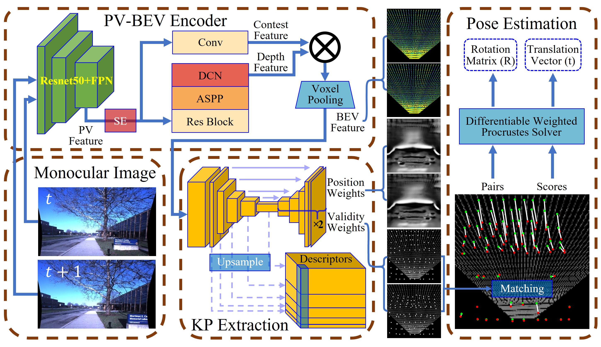
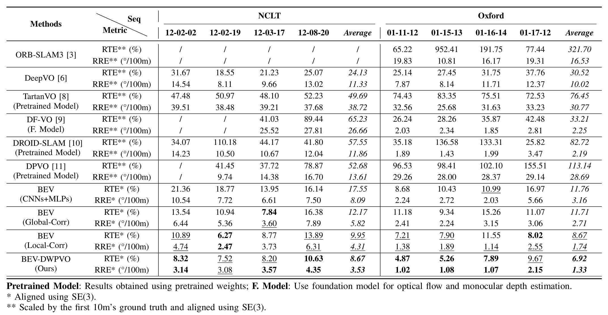
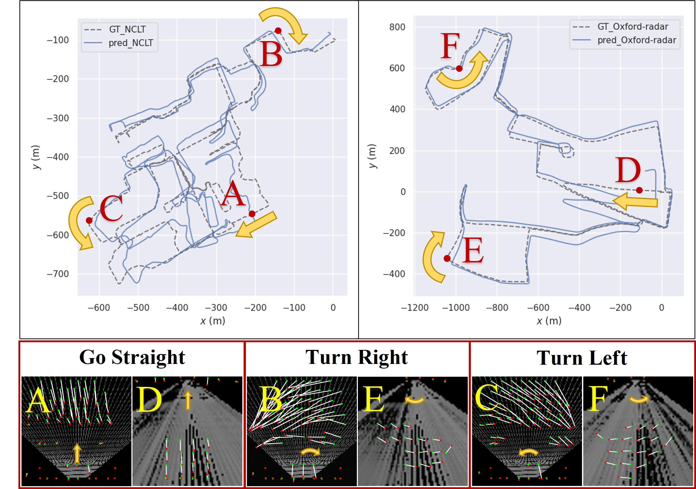

# BEV-DWPVO

**BEV-DWPVO: BEV-based Differentiable Weighted Procrustes for Low Scale-drift Monocular Visual Odometry on Ground** (IEEE RA-L 2025) [[arXiv]](https://arxiv.org/abs/2502.20078)

## Table of Contents

- [Introduction](#introduction)
- [Environment Setup](#environment-setup)
- [Data Preparation](#data-preparation)
- [Training / Testing](#training--testing)
- [Citation](#citation)

## Introduction

**BEV-DWPVO** is a monocular visual odometry system designed for ground vehicles. The system leverages a unified, metric-scaled Bird's-Eye View (BEV) representation to reduce scale drift and simplifies 6-DoF pose estimation to 3-DoF by utilizing the ground plane assumption. The framework employs a differentiable weighted Procrustes solver for pose estimation and requires only pose supervision for end-to-end training, without any auxiliary tasks. The system achieves superior performance on the challenging NCLT and Oxford datasets, particularly in scale consistency and pose accuracy, while maintaining competitive performance on KITTI.

### Framework

*Overview of the proposed BEV-DWPVO framework, including the PV-BEV encoder, keypoint extraction module, and pose estimation module.*

### Performance Comparison

*Performance comparison of different methods on NCLT and Oxford datasets.*

### Visualizations

*Visualization of trajectories and keypoint matching on NCLT (forward camera) and Oxford (rear camera) datasets.*


*Intermediate processes and visualizations on Oxford, showing keypoint extraction and matching in BEV space.*


*Intermediate processes and visualizations on NCLT.*


*Experiments on Oxford seq. 01-11-12 comparing BEV-DWPVO with ORB-SLAM3, DF-VO, and DROID-SLAM.*


*Experiments on NCLT seq. 12-03-17 comparing BEV-DWPVO with BEV(CNNs+MLPs), and BEV(Global/Local-Corr).*

## Environment Setup

### Prerequisites
- CUDA 11.6
- Python 3.9
- PyTorch 1.13.0

### Installation
```bash
conda create -n bevdwpvo python=3.9.18
conda activate bevdwpvo

pip install "pip<24.1"
pip install torch==1.13.0+cu116 torchvision==0.14.0+cu116 torchaudio==0.13.0 --extra-index-url https://download.pytorch.org/whl/cu116
pip install -r requirements.txt
pip uninstall -y torchmetrics

# build the voxel pooling CUDA op
python setup.py develop
```

## Data Preparation

Set `dataset.data_root` in the config files under `bevdwpvo/configs/` to your local copy of each dataset:

| Dataset | Config | Camera | Train sequences | Test sequences |
|---|---|---|---|---|
| NCLT | `nclt.yaml` | forward (Cam5) | 2013-04-05, 2012-01-08, 2012-02-04 | 2012-03-17, 2012-02-02, 2012-02-19, 2012-08-20 |
| Oxford Radar RobotCar | `oxford.yaml` | rear (`mono_rear_rect`) | 2019-01-11-13-24-51, 2019-01-14-14-15-12, 2019-01-15-14-24-38 | 2019-01-15-13-06-37, 2019-01-11-12-26-55, 2019-01-16-14-15-33, 2019-01-17-12-48-25 |
| KITTI Odometry | `kitti.yaml` | left color (`image_2`) | 00-08 | 09, 10 |

Training frame pairs are sampled from a pre-computed pair index stored under `pair_index/<dataset>/<sequence>/` (see `dataset.pair_index_dir` and `dataset.pair_index_file`).

## Training / Testing

Pretrained weights (`bevdwpvo_nclt.pth`, `bevdwpvo_oxford.pth`, `bevdwpvo_kitti.pth`) can be downloaded from [Baidu Netdisk](https://pan.baidu.com/s/1PlW1U9ecBo7V8KXovy6HqA?pwd=8888) (extraction code: `8888`). Put them under `weights/`.

```bash
cd bevdwpvo

# training
python train.py --config configs/nclt.yaml

# testing with the pretrained weights
python test.py --config configs/nclt.yaml --checkpoint weights/bevdwpvo_nclt.pth
```

Logs, checkpoints and the estimated trajectories (TUM format) are written to `outputs/<run>/`. Monitor training with:

```bash
tensorboard --logdir outputs --samples_per_plugin=images=100
```

## Citation

```bibtex
@article{wei2025bev,
  title={BEV-DWPVO: BEV-based Differentiable Weighted Procrustes for Low Scale-drift Monocular Visual Odometry on Ground},
  author={Wei, Yufei and Lu, Sha and Lu, Wangtao and Xiong, Rong and Wang, Yue},
  journal={IEEE Robotics and Automation Letters},
  year={2025},
  publisher={IEEE}
}
```
