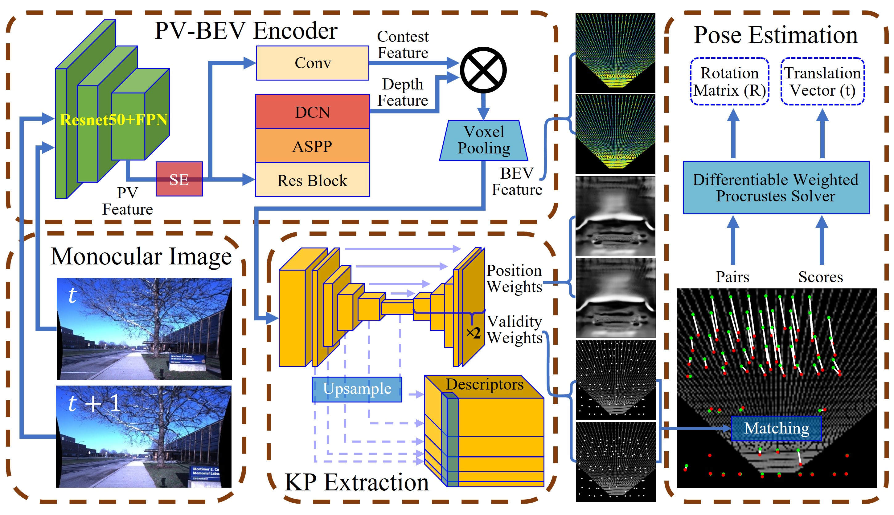
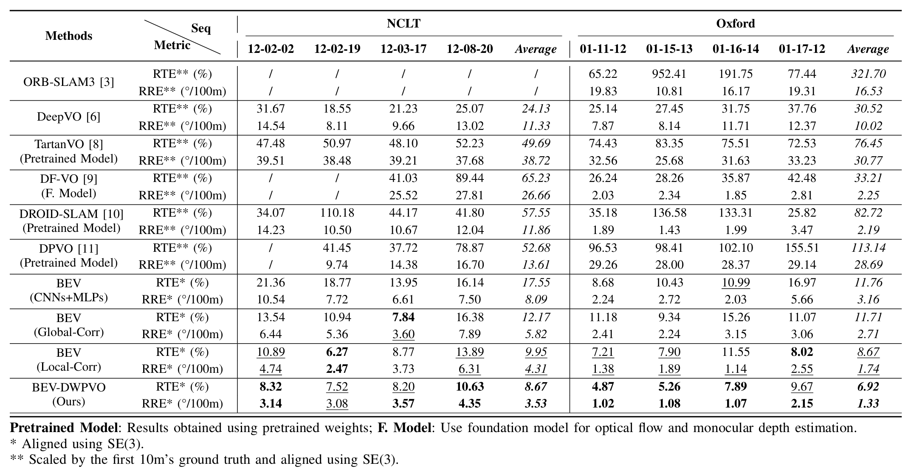
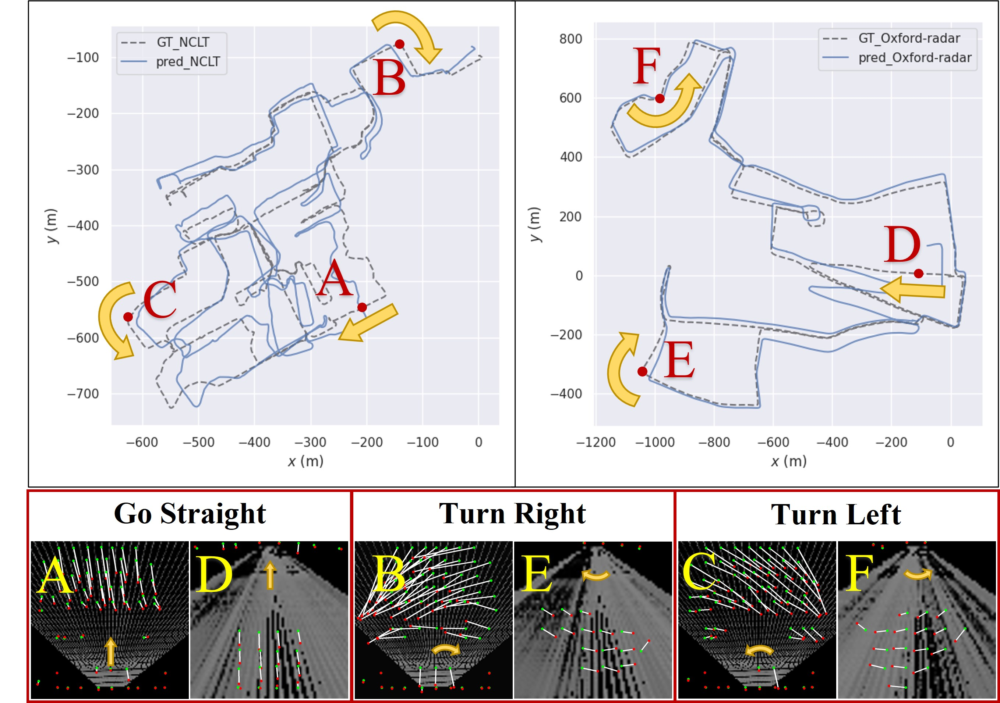

# BEV-DWPVO

## Table of Contents

- [Introduction](#Introduction)

- [Environment Setup](#environment-setup)

- [Training/Testing](#trainingtesting)

## Introduction

**BEV-DWPVO** is a monocular visual odometry system designed for ground vehicles. The system leverages a unified, metric-scaled Bird's-Eye View (BEV) representation to reduce scale drift and simplifies 6-DoF pose estimation to 3-DoF by utilizing the ground plane assumption. The framework employs a differentiable weighted Procrustes solver for pose estimation and requires only pose supervision for end-to-end training, without any auxiliary tasks. The system achieves superior performance on the challenging NCLT and Oxford datasets, particularly in scale consistency and pose accuracy. While maintaining competitive performance on KITTI.

### Framework


*Overview of the proposed BEV-DWPVO framework, including the PV-BEV encoder, keypoint extraction module, and pose estimation module.*

### Performance Comparison


*Performance comparison of different methods on NCLT and Oxford datasets. Our method achieves the best overall performance across all metrics.*

### Visualizations


*Visualization of trajectories and keypoint matching on NCLT (forward camera) and Oxford (rear camera) datasets.*


*Intermediate Processes and Visualizations on Oxford, showing keypoint extraction and matching in BEV space.*


*Intermediate Processes and Visualizations on NCLT, demonstrating robust performance under challenging conditions.*


*Experiments on Oxford seq. 01-11-12 comparing BEV-DWPVO with ORB-SLAM3, DF-VO, and DROID-SLAM.*


*Experiments on NCLT seq. 12-03-17 comparing BEV-DWPVO with BEV(CNNs+MLPs), and BEV(Global/Local-Corr).*

## Environment Setup

### Prerequisites
- CUDA 11.8
- Python 3.9.18
- PyTorch 1.13.0

### Installation
1. Create and activate a conda environment:
```bash
conda create -n bevdwpvo python=3.9.18
conda activate bevdwpvo
```

2. Install dependencies (one follow by one):
```bash
cd ./BEVDWPVO/BEVDWPVO/
pip install "pip<24.1"
pip install torch==1.13.0+cu116 torchvision==0.14.0+cu116 torchaudio==0.13.0 --extra-index-url https://download.pytorch.org/whl/cu116
pip install -r requirements.txt
pip install torch==1.13.0+cu116 torchvision==0.14.0+cu116 torchaudio==0.13.0 --extra-index-url https://download.pytorch.org/whl/cu116
pip uninstall torchmetrics
python setup.py develop
pip install --upgrade networkx
pip install transforms3d
pip install --upgrade pip
pip install nvitop
pip install spatial-correlation-sampler==0.4.0
```

## Training/Testing

1. change the dataset path
```bash
cd ./BEVDWPVO/BEVDWPVO/bevdwpvo/config_files/
```

2. open `__init__.py` and than change these code to your dataset path
```python
data_NCLT_dir = "change it to your NCLT dataset path"  
data_oxford_dir = "change it to your oxford dataset path"  
data_kitti_dir = "change it to your kitti dataset path"  
```

3. Set up TensorBoard for monitoring:
```bash
tensorboard --logdir=./bevdwpvo/ --samples_per_plugin=images=100
```

4. Start training or testing:
```bash
cd ./BEVDWPVO/BEVDWPVO/bevdwpvo/
python train.py --config=./config_files/nclt.yaml
python test.py --config=./config_files/nclt_test.yaml
```
